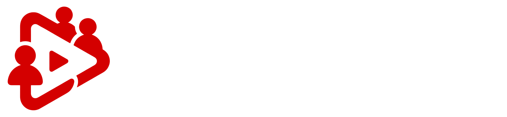
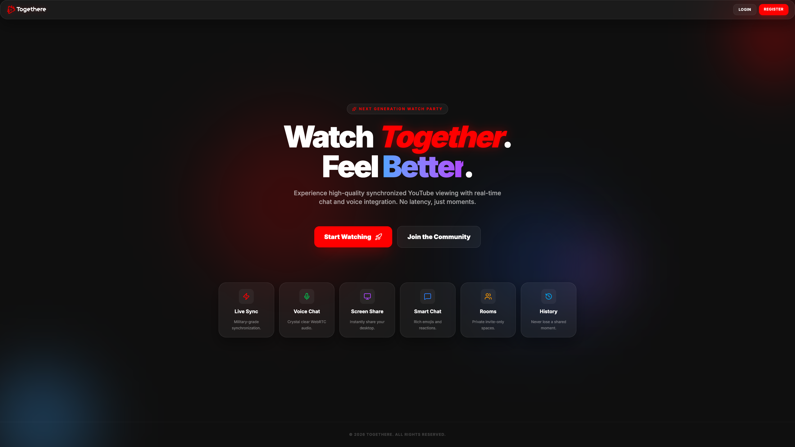
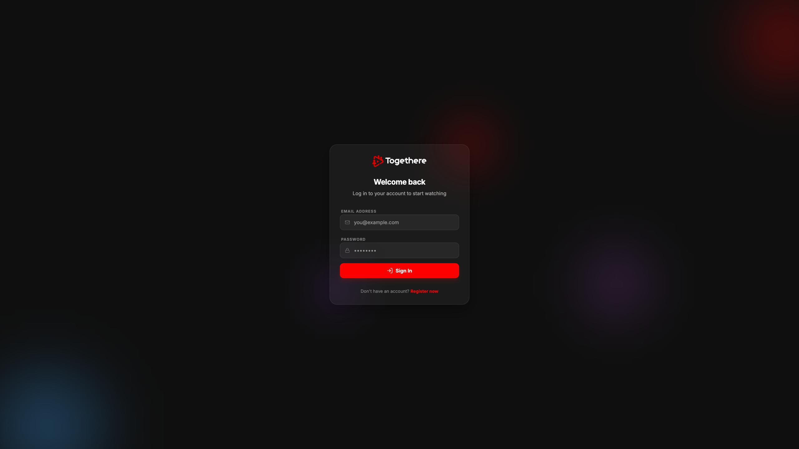
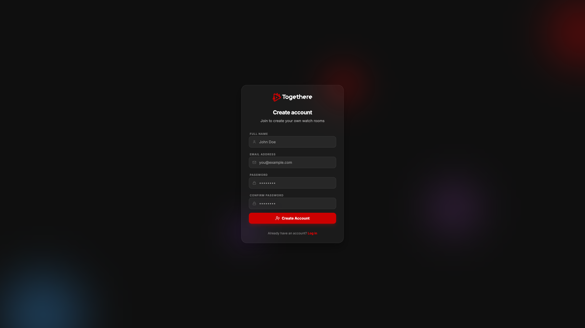
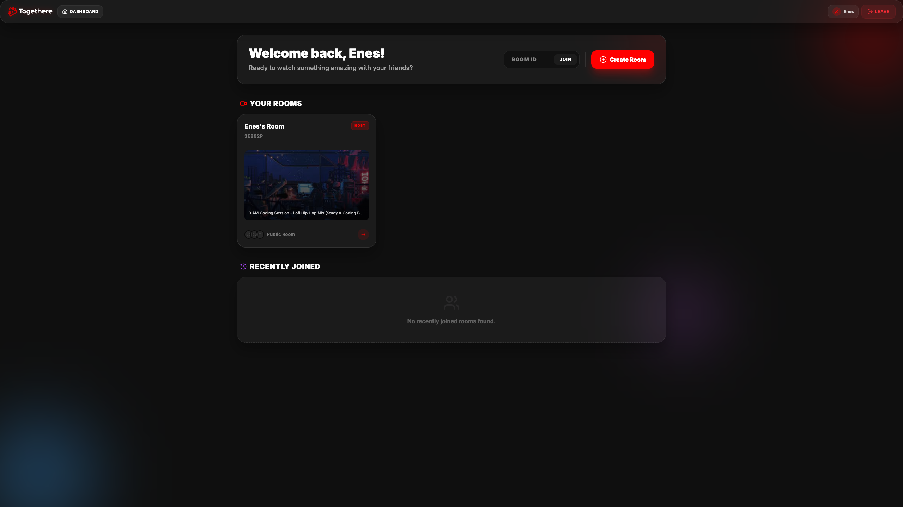
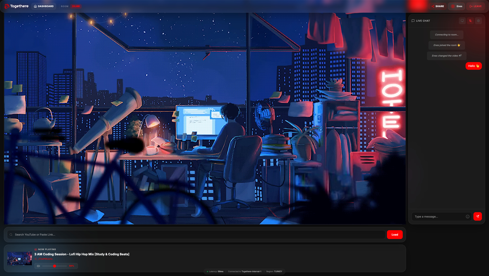
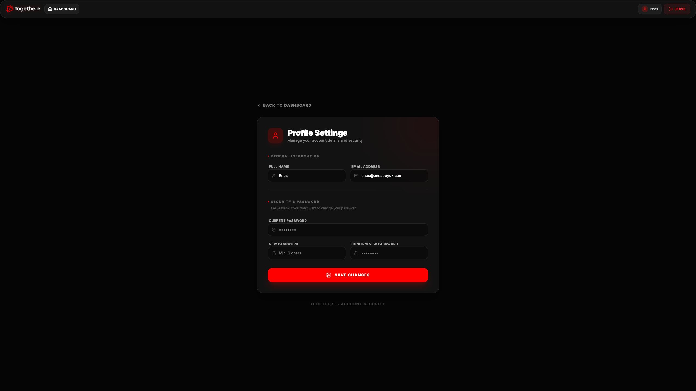

# Togethere

Togethere is a real-time web application built for watching YouTube videos synchronously with other people. It provides a shared viewing experience with low-latency synchronization, integrated chat, and voice communication.



[**🌐 Live Demo**](https://togethere.enesbuyuk.com)


## Table of Contents

- [Core Capabilities](#core-capabilities)
- [Screenshots](#screenshots)
- [Technical Details](#technical-details)
- [Requirements](#requirements)
- [Environment Variables](#environment-variables)
- [Installation and Setup](#installation-and-setup)
- [Usage Guide](#usage-guide)
- [Contributing](#contributing)
- [License](#license)

## Core Capabilities

- **Live Sync**: Precise synchronization of playback state (play, pause, seek) across all clients in a room.
- **Real-Time Communication**: Integrated text chat and WebRTC-based voice chat for seamless interaction.
- **YouTube Integration**: Direct video search and support for links, IDs, and playlists.
- **Playback Control**: Advanced queue management and session history.
- **Room Management**: Support for private room creation and joining via unique codes.
- **Screen Sharing**: High-quality, low-latency screen sharing functionality powered by WebRTC.
- **Modern Interface**: Custom-built UI using glassmorphism aesthetics and responsive layouts.

## Screenshots

### Landing and Authentication
<p align="center">
  
  
</p>
<p align="center">
  
</p>

### Dashboard and Room
<p align="center">
  
</p>
<p align="center">
  
</p>

### Settings
<p align="center">
  
</p>

## Technical Details

- **Framework**: Next.js 16 (App Router)
- **Real-Time Engine**: Socket.IO
- **Communication Protocol**: WebRTC (Voice & Screen Sharing)
- **Styling**: Tailwind CSS 4
- **Icons**: Lucide React
- **Runtime**: Node.js with tsx

## Requirements

- Node.js (Latest stable)
- pnpm (Recommended)

## Environment Variables

Create a `.env` file in the root directory and configure the following variables:

| Variable | Description | Default / Example |
| :--- | :--- | :--- |
| `NEXTAUTH_URL` | The base URL of your application | `http://localhost:3000` |
| `NEXTAUTH_SECRET` | A secret key used to encrypt session tokens | `your_secret_key_here` |

> [!TIP]
> You can use the provided `env.example` file as a template: `cp env.example .env`

## Installation and Setup

### Running with Docker (Recommended)

1. Make sure you have **Docker** and **Docker Compose** installed.
2. Create/update your `.env` file if necessary.
3. Build and start the containers:
   ```bash
   docker-compose up -d --build
   ```
4. Access the application at [http://localhost:3000](http://localhost:3000).

### Local Setup (Manual)

1. Clone the repository and navigate to the project folder:
   ```bash
   git clone https://github.com/enesbuyuk/togethere.git
   cd togethere
   ```

2. Install dependencies:
   ```bash
   pnpm install
   ```

3. Choose an execution mode:

   **Development Mode** (with hot-reload):
   ```bash
   pnpm dev
   ```

   **Production Mode** (optimized):
   ```bash
   pnpm build
   pnpm start
   ```

4. Access the application at [http://localhost:3000](http://localhost:3000)

## Usage Guide

1. Pick a display name to enter the platform.
2. Create a new room to get a unique identifier or join an existing one using a code.
3. Share the room link with others.
4. Load content using a YouTube URL or the internal search functionality.
5. Control playback as an admin to lead the shared session.
6. Share your desktop or specific windows using the high-quality screen sharing feature located in the chat panel.

## Contributing

Contributions are welcome. Please open an issue or submit a pull request for any bug fixes, optimizations, or feature additions.

## License

This project is licensed under the [MIT License](LICENSE?tab=MIT-1-ov-file).
